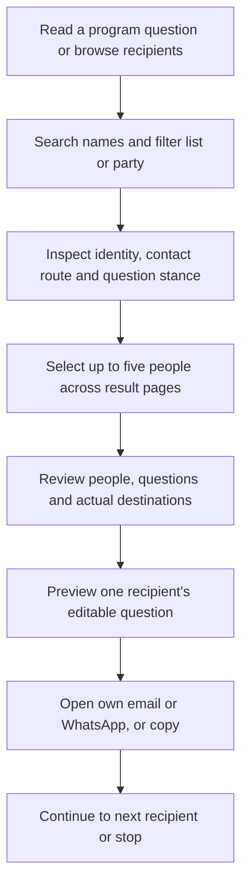

# Recipient discovery, selection and question journey

Date: 2026-09-07. Status: slice 3 adds signed multiselect, review, sequential per-person handoffs, shared-address notices, and contact revalidation. Stance UI, ETL publication, and party-fallback destinations remain later. Single-recipient `GET /:locale/request/build?recipient=` links still work.

The earlier single-recipient restriction is now an implementation milestone, not the final product scope. Existing single-recipient links and privacy guarantees remain compatible. The new scope also permits a separately reviewed public stance projection; it does not make private submitted responses public.

## 1. What the user should accomplish

After reading a program question, a visitor can find people on an explicitly named election's lists, understand who they are and where a message will go, inspect available evidence of their position on that question, select several people, and prepare and open each question through the visitor's own channel. No account or support registration is required.

Proposed flow:

Five is a proposed configurable initial UX limit, not a government or legal limit. Selection is not sending. Never open multiple mail windows automatically or use a shared To/CC/BCC list. A full multiselect session is a sequence of explicit individual handoffs.

## 2. Product review

| Visitor's question | Required product answer | Current repository gap |
| --- | --- | --- |
| Who can I contact? | Name, list/party context and explicit direct / through party / no verified channel status | Current selection shows names only and hides those without email/WhatsApp. |
| Is this a candidate or an MK? | Election candidacy and parliamentary role shown separately with dates | `politician` currently implies an MK in social mention wording. |
| Which list and which party? | Electoral list and ballot letters first; constituent party separately when verified | No election/list/party relations in current schema. |
| Can I find a name or party quickly? | One search field for reviewed name/party/list aliases and ballot letters; visible filters | No directory search/filter implementation. |
| What do they say about this question? | Question-specific, attributed, dated public evidence, or an explicit unknown state | `submitted_responses` has no question version, public stance or publication authorization. |
| Can I choose several? | Persistent-in-flow selection across pages/filters; clear removal and maximum | Existing builder accepts one recipient ID. |
| Where will each message go? | Review distinguishes selected person from contact owner and channel | Existing action route rereads an email without a displayed contact-provenance contract. |

The directory supports browsing all verified published candidacies, including those with no usable channel. The initial send-selection checkbox is available only where a reviewed direct or party-fallback channel exists. A non-contactable profile remains discoverable, explains why it cannot be selected, and may show an official source link. Existing copy behavior for eligible recipients remains; a separate copy-only selection mode for otherwise unreachable people is not part of this first flow.

Do not hide a candidate because no stance, portrait, finance record or city is known. No evidence is not opposition, and data coverage is not political merit. Use neutral ordering and identical fields for all lists. Finance stays in secondary profile detail; it must not dominate the basic contact task or block launch of the directory once its own scope is ready.

## 3. UX specification

### Entry and information hierarchy

- Entry from program content preserves an operational demand ID and visibly sets the question context. Entry from the directory uses an explicit question picker; do not assign a stance badge without saying which question it describes. For the first release, program questions mean the existing ten `document='standard'` demands. Coalition/100-day items require a later explicit question mapping.
- Heading: “Choose whom to ask”, with election number and source snapshot date. If the selected election's approved list is not available, explain that state; historical data has an explicit archive label and is never presented as the new candidate list.
- Search label: “Name, party, list or ballot letters”. Separate “Electoral list” and “Party” filters avoid equating a joint list with one constituent party. Party filter includes only candidates whose individual constituent-party affiliation is known; do not assign every joint-list candidate to every party in it.
- A question selector sits above results: “Position on: [question title]”. Search suggestions and list/party filters narrow discovery; adding a recipient remains an explicit checkbox action.
- Each result is a compact semantic card/row: selection checkbox; optional portrait or neutral placeholder; name; list, ballot letters and rank; known party; current/historical role; direct contact or named fallback owner; stance summary for the selected question; “Details and sources”. City/committees/finance are secondary details. Do not display an empty placeholder for every missing optional field.
- Names and list titles may wrap. Essential labels never depend on hover, icon shape or color alone. The whole card is not one giant button: selecting and opening details are separate controls.

### Search and filters

Search uses normalized Hebrew and curated aliases from the ETL plan, plus reviewed localized names/aliases. Exact and prefix matches precede weaker text matches. Search relevance is textual only, never political or personalized. Weak spelling matches can be suggested as “Possible matches”; they do not establish identity or preselect anyone.

Whitespace-separated terms match across the combined name/list/party/ballot fields. Filters intersect with the search. Within a multi-valued filter use OR; across filter types use AND. A party/list combination with no matching affiliation shows an empty result and clear filters, not silently widened results. Changing search/filter resets pagination but retains selected IDs. Show total matches, current page, and how many selected people are hidden by current filters. Initial page size: 20; enforce maximum 50 server-side. Prefer numbered/next-previous pages to infinite scrolling for predictable return and no-JS operation.

### Selection and review

Maintain a visible selection summary: “3 people selected — review questions”. Selected rows show a checkbox state and removable names in a collapsible basket. Filter changes never discard selections. A sixth selection produces an inline explanation and retains the original five. Autosuggest helps find results; it never fills the basket. An unbounded “select all lists” control is outside the planned flow.

Review shows every selected person, election/list, requested questions, available channel and actual contact owner. Example: “Candidate B — email through Party A; direct personal email unavailable.” If two selected people resolve to the same party mailbox, show “2 people, 1 shared party address”. Keep separate individual drafts initially and let the visitor remove a duplicate; never silently drop a person, merge drafts, or describe this as two distinct inboxes.

Use “Prepare questions” and “Open email for [name]”, not “Send to all”. Default the explicit chosen program question when entering from its page; otherwise offer all ten standard questions with a visible edit control. A stance never removes or selects a question automatically. Users can ask about an already published stance without the product inventing a confrontational follow-up.

After opening an external channel, allow “Next person”, “Copy instead” and a separate optional “I sent it” report. Label opened/copied/reported sent honestly; none proves delivery. Show progress by person and do not count a failed handoff as sent. A browser return is not proof that the message was sent. Shared-mailbox duplicates remain visible during progress.

### Accessible and responsive behavior

Use native labelled checkboxes, forms, buttons, selects and `
`. Desktop can put the basket beside results; mobile stacks it and may use a compact sticky review bar with enough bottom space to keep focused controls visible. The basket must also remain reachable in document flow. Details expand inline in the first release, avoiding a focus-trapping drawer as a prerequisite.

Target approximately 44px touch controls as a product choice; check WCAG 2.2 AA's 24px minimum/spacing exceptions separately. Announce result-count and selection changes through a concise polite status region. Keep keyboard focus stable during filtering and return it predictably after removal; no focus theft after each keystroke. Check that sticky elements never entirely obscure focus. Sources: [target size](https://www.w3.org/WAI/WCAG22/Understanding/target-size-minimum.html), [status messages](https://www.w3.org/WAI/WCAG22/Understanding/status-messages.html), [focus visibility](https://www.w3.org/WAI/WCAG22/Understanding/focus-not-obscured-minimum.html).

Verify keyboard-only and screen-reader operation, 200% text resizing, 400% zoom/reflow, light/dark themes, long names, missing images, and 320/390/768/1440px layouts. Hebrew/Arabic/Yiddish RTL must preserve checkbox order, logical spacing, ballot letters and isolated LTR contact values. Use text with any stance marker; no red/green approval scale. With JS disabled, search, paging, selection, details, review and one-person sending still work through server forms.

## 4. Stances need their own evidence model

No current public source in the ETL cascade automatically establishes a person's position on the platform's exact questions. Knesset service, voting history, committee membership and donation data do not substitute for a stance. Start with human-curated, source-backed records; no automatic political inference or classification is required.

Suggested display vocabulary for a selected question:

| Evidence state | Display | Rule |
| --- | --- | --- |
| Reviewed explicit personal statement | “Supports”, “Supports with reservations”, “Opposes”, or “Statement available” | Reviewer establishes exact question relevance; always offer dated excerpt/context/source. A non-classifiable statement uses the last label. |
| Only organizational position found | “Party position available — individual position unknown” | Show attributed party/list statement separately, never inherit it onto the person. |
| No reviewed publication | “No verified position available here” | This does not claim they were asked, refused, or did not answer elsewhere. |
| Older question version or changed affiliation | “Earlier statement — see context” | Not a current answer unless reviewed against the current version/context. |
| Contradictory statements | “Multiple statements — see dates” | Preserve evidence; no forced single badge. |
| Retraction/correction/source unavailable | “Under review” or historical context | Remove unsupported current summary while retaining appropriate material history. |

Add `program_question_versions` (demand FK, campaign, semantic version, canonical text hash and review date) and versioned `public_stances` (exactly one subject FK: person/party/electoral list; question-version FK; election/context; classification; bounded reviewed summary/excerpt; source URL; statement and verification dates; reviewer; publication state; supersedes link). Add source-evidence and translation relations where more than one source/locale is needed. Index by subject + question version + publication state. Changes in translation alone do not fabricate a new political position; semantic canonical changes require review/versioning.

Add reviewed `candidacy_party_memberships` to the identity model: candidacy FK, party FK, effective dates, evidence/review state. List-party membership alone cannot support individual party filtering or fallback selection in a joint list.

Publish only reviewed public stance fields. Private submitted response text, submitter email and attachments never flow directly to this table or public routes. A moderator's existing `confirmed` status is not permission to publish. If a submitted response is used, an admin must establish authenticity, relevant question, permission for the chosen excerpt, redaction and subject attribution, with a separate publication decision. Track that dependency privately; source withdrawal/deletion must trigger review/unpublication of dependent material unless independent public evidence supports it. Public JSON/HTML must never include private source IDs, emails or attachment keys.

Stance approval/correction/retraction uses the existing admin authorization, CSRF and atomic audit pattern. Refresh/review dates and independent source status are visible. No overall score, party leaderboard, endorsement icon or stance-derived personalized recommendation. Add published methodology explaining classification, unknowns and correction contact before showing stance labels to visitors.

## 5. Technical design for this repository

### Read model and routes

Use the accepted ETL publication through a shared directory read model. Add modules such as `src/recipient-directory.tsx` for routes, `src/recipients.ts` for queries/resolution, `src/recipient-selection.ts` for transient state validation, and `src/stances.ts` for reviewed stance reads/admin publication. Keep Hono SSR, native forms and the same-origin hashed JS/CSS assets; optional enhancement only updates the result region and basket.

Proposed routes extend the existing flow rather than repurposing its public IDs:

- `GET /:locale/request`: initial searchable directory, with optional public demand context.
- `POST /:locale/request/search`: bounded query/filter/page plus current signed basket; returns SSR HTML (or a deliberately negotiated fragment).
- `POST /:locale/request/selection`: add/remove ID and validate basket.
- `POST /:locale/request/review`: validate people, questions and destination snapshot; render review.
- `POST /:locale/request/build`: multiselect flow begins or advances one person's composition; retain the existing GET build route for old single-recipient links.
- Existing preview/action/copy/report-sent/result routes: compatible single-recipient operations with transient progress state and mandatory current contact validation.
- `GET /:locale/recipients/:id`: optional bookmarkable public details after publication rules exist; the complete first journey can use inline details instead.

Search names and selection IDs stay out of URL query strings, browser storage and analytics. Initial GET pages have no visitor selection. Search/selection/review POSTs and personalized responses are private/no-store; configure edge and origin logs not to capture their bodies. Do not put a basket into cookie/localStorage/sessionStorage or server session tables. Only theme/language keep their existing storage behavior.

Carry a short-lived, purpose-bound signed basket in POST hidden fields: distinct recipient IDs, election, publication/version reference and expiry, maximum five. This token authenticates state but is not encryption; do not include private data or claim it is private storage. Optional enhanced browser state is in-memory only. Validate every ID's candidacy, locale/eligibility and channel again on review/action; a client cannot choose an arbitrary destination by tampering with fields. Use separate signing domains from existing request capabilities. On expiry/restart/version change, explain how to review the selection again.

Selection survives filtering/pagination and the supported forward/back controls within the flow. Do not promise persistence across tab closure or reload. Before composing personal text, finish search and selection. While composing, changing recipient/context may require re-preview and an explicit notice that text is not saved. No-JS forward transitions can carry only the current transient text needed for review/handoff; never carry a bundle of personalized drafts. Browser back-cache behavior is not the durability contract.

### Database and metrics compatibility

Keep one `generated_requests` row per actually prepared recipient and its existing public ID. A basket of five does not create five generated requests until their individual previews are prepared. Do not add a batch ID tied to a supporter, duplicate `request_actions` across a basket, or persist full basket contents as preference history. Existing retention indexes and per-row public capability checks remain intact. Where operational replay protection is needed, bind it to individual request IDs, not visitor identity; do not change the metric definitions silently.

The initial multi flow creates at most one personalized preview at a time. Carry approved question IDs and remaining recipient IDs in transient signed state. Per-recipient copy/opened/reported-sent actions remain distinguishable. Any changed channel, withdrawal, manual suppression, stale publication or locale loss is revalidated and shown as a per-person exception before a new handoff. Other valid recipients can continue after explicit review; never silently replace an invalid person.

Directory queries must not call live government services. Use bound SQL, escaped LIKE patterns or a tested search index over normalized tokens, and limit query length (initial 100 characters), page size and result bounds. Start with indexed normalized name/alias/list/party joins for the election-sized dataset; add SQLite FTS only if measured need justifies it and Hebrew behavior is verified. No broad fuzzy comparison across all people on every keystroke. Debounce optional JS search and suppress out-of-order responses so old results cannot overwrite a newer filter/basket state.

Count results by distinct candidacy/recipient identity; many-to-many party joins must not duplicate cards or inflate counts. Fetch stance/contact data in bounded joins or batches, avoiding one query per card and never loading all finance history for results. Pin each page to a publication so pagination is stable; on publication change refresh the result set and flag affected selections. All state transitions must preserve existing CSRF, per-IP abuse controls, CSP, campaign kill switches and no automatic sending.

### Shared mailbox example

Five selected candidates may resolve to only three contact addresses. Display both facts. Resolve addresses server-side using only the published channel normalization, not speculative email aliases. Initial behavior is five separately reviewed possible drafts with clear repeated-address notices. The visitor can remove people or stop after any draft. Aggregation, bulk sending and automatic deduplication would change who is being asked and require a separately designed behavior; they are not assumed here.

## 6. Scenario verification matrix

These are design walkthroughs and future implementation tests. They are not claims of executed browser or user tests.

| Scenario | Product/UX outcome | Technical assertion |
| --- | --- | --- |
| Arrive from question 4 | Question 4 context remains visible; search and stance refer to it | Valid active standard-demand ID/version, no query text or stance inference. |
| Search a spelling variant | Clearly named exact/possible matches; nobody auto-selected | Curated alias/normalization fixtures; identity IDs unchanged. |
| Search a party within a joint list | Results reflect verified individual party memberships | No cross-joining every candidate to each constituent party. |
| Filter after selecting two people | Selection count stays two even if neither is visible | Basket remains unchanged through search/page POST. |
| Try a sixth selection | Clear maximum message; first five remain selected | Server rejects excess/duplicate/unknown IDs with unchanged valid state. |
| No portrait, city or stance | Readable name, list/rank and contact; neutral unknown text | Nullable fields do not remove a valid candidate from discovery. |
| No valid channel | Profile stays discoverable; cannot add to send basket | Discovery and send eligibility are separate predicates. |
| Only party stance available | “Party position” with individual unknown | Subject FK must not be rewritten to candidate/person. |
| Answer exists to an older question | Historical context, not current support badge | Question version mismatch blocks current classification. |
| Private response marked confirmed | Nothing appears publicly without publication review | Public queries exclude private tables and unpublished stance records. |
| Two people share one fallback address | “2 people, 1 shared party address”; explicit drafts | Distinct chosen people; verified shared destination; no silent merge. |
| Contact changes after review | Re-preview for that person, no wrong-address handoff | Fingerprint/activation/expiry recheck before recording/opening action. |
| Person withdrawn mid-session | Named exception and remove/review action | Server does not trust old signed eligibility; others can continue. |
| No matching results | Clear empty state with active filters and clear control | Zero matches is not a source outage or an empty election. |
| Upstream outage | Last accepted directory with date/appropriate stale state | No live-fetch dependency; expired contacts disabled by resolver. |
| Keyboard/screen-reader/RTL mobile | Understandable selections, evidence and next action | Native semantics, announcements, reflow and focus checks. |
| JS unavailable or search responses race | Full form journey works; newer state is preserved | SSR fallback and enhanced request-order/basket version tests. |
| Return from email without sending | Continue/copy/report options, no delivery claim | No automatic reported-sent event. |
| Close/reopen page | No stored selection or drafts recovered | No preference/draft storage; fresh state. |

## 7. Verification gates and implementation order

**Design review completed:** inspected current request selection/action code, response schema/moderation, admin audit/roles, privacy/storage rules, ETL proposal and prior redesign plan. Confirmed that search/filter, multiselect and public question stances are missing. Walked the matrix against proposed states and identified the schema/route changes above. An illustrative interaction in the conversation uses fictional records; it is not evidence of working production functionality.

**Illustration checks executed:** a DOM simulation exercised selection, retaining hidden selections across filters, two selected people sharing one address, token-prefix name search, an empty result, and clearing selection. Those checks passed after correcting a substring-search false positive. The illustration makes no network calls and uses no browser storage. This verifies its small interaction model only; it does not test rendering, production routes, real data, Hebrew matching, assistive technology or the full five-person flow.

**Technical tests to run after implementation:** deterministic directory fixtures for joint lists, mixed scripts, homonyms, null fields and source revisions; signed-basket tampering/expiry/limit tests; duplicate-page/record tests; contact-change and shared-mailbox tests; stance publication/authorization/version/retraction tests; zero private data in HTML/audit/logs; old single-recipient links/public IDs; full typecheck/tests/smokes. Load the directory while ETL and retention operate on the documented host budget.

**UX validation to run:** perform the journey on desktop and 390px RTL mobile, with keyboard, screen reader and no JS. Automated accessibility checks supplement manual review. Test with at least five representative visitors, including Hebrew/RTL users: find a named person, find people by party/list, select three across filters, identify a fallback destination, distinguish a party stance from a personal stance, and prepare the first question. Proposed success gate: at least four of five complete discovery/selection without assistance; every participant correctly understands actual destination and that opening email does not mean delivery. Any misattribution is a blocking design defect. Record observed issues; five participants do not establish universal accessibility or a statistical success rate.

Implement in vertical slices:

1. Verified directory read model, neutral visual cards, search/list/party filters, unknown states and one complete individual handoff.
2. Signed multiselect + basket/review + sequential per-person handoffs, shared-address warnings and invalidation behavior. This is required for the requested complete journey.
3. Reviewed stance model/admin workflow and question-context display, including attribution/unknown/version/retraction states. The first two slices show truthful unknowns until approved evidence exists; stance support is not silently omitted from final scope.
4. Complete locale, accessibility, privacy/load/recovery verification and participant testing. Finance follows its independent ETL source gate and secondary profile presentation.

The exact target election remains unconfirmed. Five selections, 20 results per page, inline details and sequential sending are proposed defaults that allow implementation planning without blocking on routine UI choices. The user's latest scenario authorizes planning search/filter, multiselect and available public stances; prior single-recipient-only or no-public-stance scope notes do not veto that request. Implementation and publication remain pending under the original phased task.

## 8. Search autosuggest, existing-flow integration and question help

The user clarified that the requirement is autosuggest inside the search text box. Suggestions help identify a person, party or electoral list; accepting one narrows the directory results and never adds anyone to the recipient basket. Manual multiselect and the existing question defaults remain separate behaviors.

### Autosuggest in the search box

As the visitor types, show a compact suggestion list under the existing search field. Each option contains a reviewed display name, an explicit type label (person / party / electoral list), and enough context to distinguish it: election/list and rank for a person, ballot letters for a list. Preserve homonyms as separate options. Include unavailable-contact people as discoverable matches with a brief status; discovery is not send eligibility. Do not put full profiles, question tooltips or selectable checkboxes inside a suggestion row.

Initial limits: start after two normalized characters, with a 200 ms debounce and at most eight suggestions. Support an exact one-character ballot-letter lookup as an exception so short official list identifiers remain searchable. No suggestions for empty input, no recent-search history or political popularity defaults. Query reviewed names and aliases from the accepted local directory publication, using exact then token-prefix relevance with stable neutral tie-breaking. Fuzzy-only matches, if offered, are explicitly labelled possible matches. Never infer identity from a suggestion.

Accepting a person suggestion shows that exact person's result; accepting a party/list suggestion applies the corresponding visible removable filter. Respect existing filters; conflicting scope returns a clear empty state and edit/clear controls rather than silently widening it. Use typed entity IDs, not the display string, to resolve homonyms. After acceptance, clear consumed free text and show the applied entity as a removable search/filter chip. Further typing can refine the remaining scope; removing the chip returns to broader results. Preserve the basket throughout. Enter with no active suggestion submits the typed free-text search. Neither blur nor the first suggestion automatically accepts an option.

Use an editable combobox with manual suggestion acceptance: accessible label, `aria-autocomplete='list'`, `aria-expanded`, `aria-controls`, listbox/options and `aria-activedescendant` while DOM focus stays in the input. Up/Down navigates; Enter accepts the active suggestion; Escape closes without clearing text; Tab leaves without accepting. Keep normal text editing and IME composition behavior; defer lookups until composition ends. Pointer/touch selection must survive blur ordering. Announce concise loading/result/unavailable states without reading every keystroke. Follow the [W3C combobox pattern](https://www.w3.org/WAI/ARIA/apg/patterns/combobox/); validate actual screen-reader behavior before launch.

Add `POST /:locale/request/suggest`, returning only bounded public option fields and publication ID. Validate locale, query length, entity/filter IDs and election server-side; use prepared queries and a separate bounded incoming rate limit. Do not call government services per keystroke. Suggestions do not need the basket or personal text. Responses are private/no-store and search request bodies are excluded from logs/analytics. Keep CSRF/origin controls consistent with the existing search POST flow. Native fetch enhancement stays in the hashed app asset.

Abort prior lookups where possible and discard responses with an older query/filter/publication sequence. Clear an active option when its results change so Enter cannot accept an invisible stale option. Validate accepted IDs against the current publication on the search request. On timeout/429/outage, show that suggestions are unavailable and leave ordinary search working; a failure must not claim zero matching people. Without JavaScript, the labelled text field and Search submit button still return ordinary server-rendered results. No third-party search service or persistent visitor history is required.

### Integrate into the current journey

| Existing entry or stage | Planned behavior |
| --- | --- |
| Home and `AskPanel` in `src/components/public-ui.tsx` | Keep the existing CTA and destination `/:locale/request`. A question-specific CTA may pass its public demand ID; do not replace navigation or introduce a second site/app. |
| `/:locale/request` | Add search with autosuggest, filters, cards and manual selection within the existing `Layout`, `JourneyIntro` and recipient panel. Selection starts empty unless a valid explicit recipient link supplies context. |
| Existing GET `/:locale/request/build?recipient=…` | Retain the one-person path and validation. Preselect that explicitly requested eligible recipient; do not fill the rest of the basket automatically. |
| Question selection/build | For a valid question-specific entry, initially check that demand; for a general entry, initially check all active, reviewed, translated standard demands. Display the resulting count and missing-translation state. Users can deselect and use “Select all available questions” / “Clear questions”. If none remain, explain that at least one question is required. |
| Return from review or validation error | Preserve the visitor's explicit choices, including deliberate empty selection. Defaults apply only when no selection has been initialized; empty and missing are different states. Switching the stance-display question never changes the send-question selection. |
| Multi-person review | Show selected people, common question set, actual destinations and duplicate mailbox notices. Allow edits before personal composition. Preserve explicit question IDs while moving to the next person. |
| Existing preview/action/result | Render one editable personal preview at a time, using existing templates and actions. Revalidate contact and selected demands; keep user-controlled sending, public IDs, aggregate action vocabulary and personal-text non-persistence. |

Changing message locale revalidates demand/name translations and shows unavailable items; it must not silently replace questions or discard manual selection. Store a boolean selection-initialized marker with the transient state so a missing checkbox field cannot accidentally restore all defaults. This needs a source-backed review/availability policy for demand translations; existing presence in a translation table alone is not proof of human review.

### Question explanations and tooltip behavior

Add a separate, clearly labelled “About this question” control next to each question title in the builder and beside the currently displayed stance question. Clicking help must never toggle its question checkbox. Keep the short title and any essential caveat visible even when help is closed.

Each explanation should briefly answer: “What is being asked?” and, where useful, “What would a concrete answer include?” Use the canonical clause body and rationale as the source. Do not infer legal meaning, omit material reservations or generate new political wording at runtime. Add an optional reviewed `help_summary` to the versioned question translation model, tied to canonical question version and locale. Until that short summary is reviewed, show existing reviewed clause text in an inline disclosure; if unavailable, show the localized unavailable state. Do not truncate legal text mid-sentence to manufacture a tooltip.

For a short text-only explanation, enhance a labelled help trigger with a tooltip on hover and keyboard focus. The tooltip uses `role='tooltip'` and an accessible description relationship, contains no links or buttons, retains trigger focus, supports Escape, remains visible while pointer/focus uses it, and is hoverable. Tap/click opens the same explanation as a persistent inline disclosure with a clear close/toggle action, suitable for touch and magnification. Links to the full clause belong in that disclosure or next to the help control, outside the text-only tooltip. Do not rely on the browser `title` attribute as the only explanation. Without JS, native `
` provides the explanation. Avoid duplicate screen-reader announcements when enhanced mode is active.

This behavior follows [W3C hover/focus guidance](https://www.w3.org/WAI/WCAG22/Understanding/content-on-hover-or-focus.html). The [ARIA tooltip pattern](https://www.w3.org/WAI/ARIA/apg/patterns/tooltip/) is supplementary guidance; interactive content belongs in the disclosure rather than a tooltip.

### Theme and design are fixed constraints

The conversation illustration is for behavior, not a replacement design specification. Implement inside the current public shell and component system: reuse `Layout`/`Shell`, `JourneyIntro`, `Surface`, `PrimaryAction`, `Callout`, existing fieldset/card spacing and Pico token overrides. Preserve the current typography, system fonts, Amharic font scope, techelet action color and amber caveat usage. Do not import another component library, font family, palette or app shell.

All new CSS and enhanced interactions live in the existing same-origin hashed assets in `src/assets.ts`. Reuse current semantic theme tokens instead of literal colors. Preserve light/dark/system behavior and the render-blocking theme bootstrap; no inline style/script attributes or CSP relaxation. Position help with responsive logical CSS/inline disclosure rather than JS-written style coordinates. Keep bidi isolation, reduced motion, visible focus, mobile spacing and current navigation intact. Ensure popovers/disclosures remain readable and unclipped with long Hebrew/Arabic text, at 320px and at zoom. Selected cards use the existing selection/accent treatment rather than new political color coding.

### Added acceptance cases

- Typing a partial name/party/list shows bounded, typed suggestions; homonyms and joint-list affiliations remain distinguishable.
- Choosing a suggestion narrows results but leaves existing basket selections unchanged; no option is accepted merely on blur.
- Exact one-letter ballot search works; empty search shows no personalized defaults.
- Arrow/Enter/Escape/Tab, touch and IME input work without accidental form submission or stale-option acceptance.
- Out-of-order results, filter changes, publication changes, timeout and rate limiting preserve text, basket and ordinary search.
- No-JS search remains available; query text is absent from URLs, storage and logs.
- General entry defaults questions once; question entry selects its exact demand; clear-all and validation errors never reset choices.
- Help opens without selecting/deselecting the question; hover, focus, Escape, tap, no-JS and screen-reader behavior expose equivalent information.
- Explanation text matches the current canonical version and reviewed locale; no unreviewed fallback or silent loss of a caveat.
- Visual regression review covers current pages and the new controls in light/dark/system, RTL/LTR and mobile, including unchanged header, navigation, typography, theme switching and CSP.

These are additions to the implementation/testing plan. No production selection or tooltip code has been implemented or browser-verified in this planning turn.
