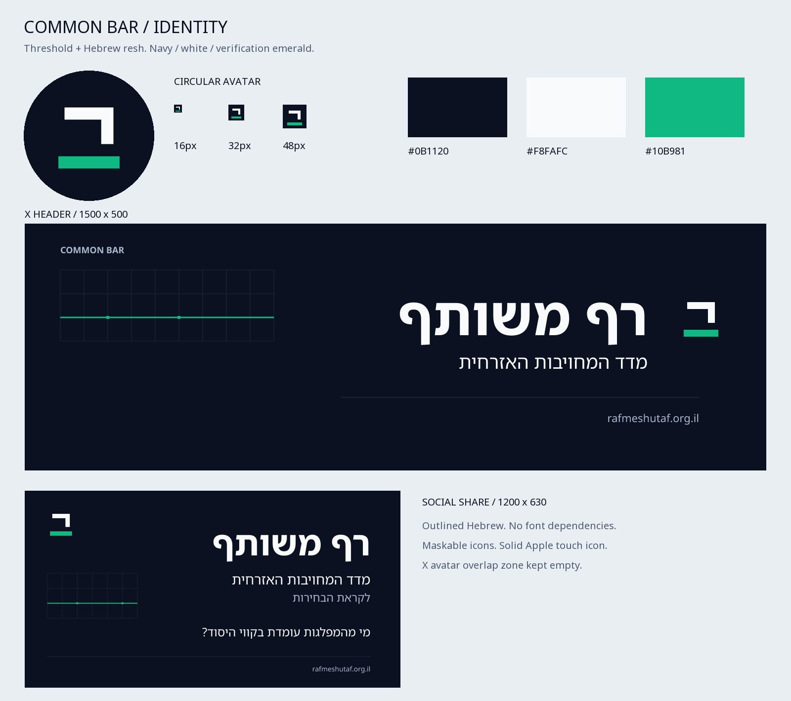

# רף משותף · Common Bar

The identity combines a geometric Hebrew **ר** with a firm horizontal threshold.
The open space between them keeps the mark legible at 16 px. The symbol is a brand
signature, not a party endorsement or a verification badge for individual claims.



## Palette and typography

| Role | Color |
| --- | --- |
| Foundation | Slate navy `#0B1120` |
| Primary mark | Light slate `#F8FAFC` |
| Threshold accent | Emerald `#10B981` |
| Small text on white / interface actions | Dark emerald `#047857` |

Use the bright emerald as an accent on navy; use dark emerald for readable links
on white. Monochrome and transparent variants are included. Preserve the symbol's
orientation in RTL and LTR layouts; do not mirror it. Leave at least four units of
clear space on the 32-unit master grid. The favicon uses a larger optical size than
the maskable/app icon and avatar. Use `favicon.svg` below 48 px.

Artwork lettering is Noto Sans Hebrew (750 for the name, 400 for supporting copy),
converted to paths with HarfBuzz shaping. SVGs require no fonts, scripts, CSS,
embedded bitmaps, or network requests. The website retains its accessible live
text and system font stack. Hebrew uses “רף משותף”; other locales use the supplied
English proper name “Common Bar” rather than new unreviewed translations.

## Ready-to-use exports

All final files live in [`public/`](../../public/).
The [download kit](common-bar-identity.zip) contains the exports, preview, and font
licenses, with no authoring dependencies required to use the artwork.

| Files | Use |
| --- | --- |
| `favicon.svg`, `favicon.ico` | 32-unit SVG; ICO contains 16, 32, 48 px images |
| `icon.svg`, `icon-192.png`, `icon-512.png` | App icons with maskable safe area |
| `apple-touch-icon.png` | Opaque 180 × 180 px Apple icon |
| `logo.svg`, `logo-light.svg` | Outlined Hebrew lockup, transparent, 640 × 128 |
| `logo-mark.svg`, `logo-mark-light.svg`, `logo-monochrome.svg` | Transparent symbol variants |
| `x-profile-avatar.svg`, `x-profile-avatar.png` | 400 × 400; essential shapes inside the central 340 px circle |
| `x-banner.svg`, `x-banner.png` | 1500 × 500; bottom-left 300 × 200 px is solid background |
| `og-image.svg`, `og-image.png` | 1200 × 630; requested Hebrew election-accountability copy |
| `manifest.json` | Hebrew app name and `any maskable` icon entries |

Social platforms accept the PNG exports; SVG files are editable masters. The
banner's ledger graphic is decorative and contains no claimed measurements.

The app serves both stable download URLs and content-hashed URLs. Page icon links
use hashes; stable downloads revalidate so future deployments do not strand old
branding in browser caches. The existing localized sharing cards in
`src/assets/share-*.png` use this identity with the existing localized slogan.
The Hebrew card matches `public/og-image.png` exactly. Home, issue, and scorecard
sharing metadata continue to use the app's configured `APP_BASE_URL`.

The root URL retains the project's locale redirect. Its share preview follows
that locale; use `/he` for a consistently Hebrew preview. The manifest provides
app identity; this change does not add an offline service worker.

## Regenerate

Normal builds need only the existing Node dependencies; all artwork is checked in.
For intentional artwork edits, use Python 3.12+ in a separate authoring environment:

```sh
python -m pip install -r scripts/brand/requirements.txt
python scripts/brand/generate.py
python scripts/brand/verify.py
```

Edit the primitive geometry or copy in the generator, then inspect
`docs/brand/identity-preview.png`. Review any edited translations separately from
visual QA. Font sources are stored under `source/` with their SIL OFL licenses:
[Noto Sans Hebrew](https://github.com/google/fonts/tree/main/ofl/notosanshebrew),
[Noto Sans](https://github.com/google/fonts/tree/main/ofl/notosans), and
[Noto Sans Arabic](https://github.com/google/fonts/tree/main/ofl/notosansarabic).
Amharic uses the repository's existing licensed Noto Sans Ethiopic asset.

This kit and the local site integration do not publish the site or upload to X.
